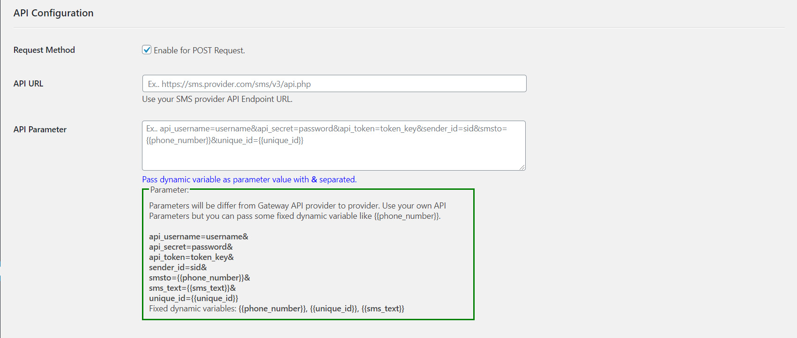
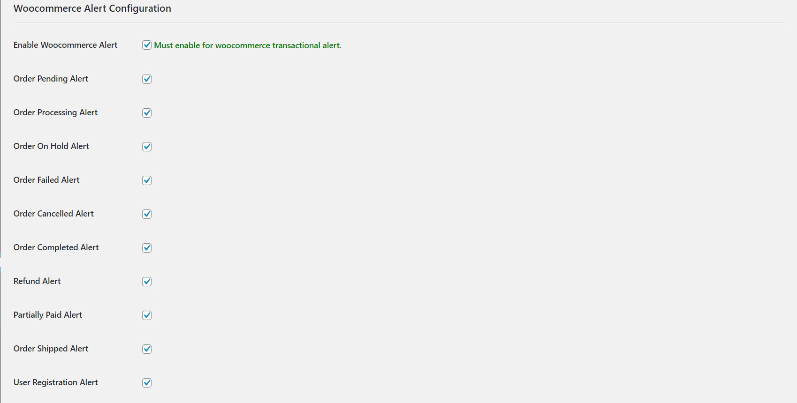

# Real Protection OTP & Woocommerce SMS/Email Alert

RP is an SMS & Email based OTP service provider plugin. Also available woocommerce transactional alert.
## Features!
  - OTP SMS
  - OTP Email
  - New user registration alert
  - Woocommerce transaction alert
  - Configurable custom API & Parameters
  - Dynamic variable.

### Prerequisites
  - Wordpress 5.x.x
  - WooCommerce 4.1.x
  - cURL php extension.

### Version
  - RP V1.0.0
  - Tested up to WooCommerce 4.1

### Download
```sh
Using HTTPS 
$ git clone https://github.com/prabalsslw/RP-OTP-Woocommerce.git
Using SSH 
$ git clone git@github.com:prabalsslw/RP-OTP-Woocommerce.git
```
### Installation
Follow the installation steps.
- Step 1: Upload the plugin to wordpress admin panel. [Img-1]
- Step 2: Go to `Real Protection` > `OTP Settings` page.
- Step 3: Enable OTP checkbox for OTP & SMS Alert. `OTP SMS Text` must contain `{{OTP}}` dynamic variable. [Img-2]
- Step 4: Both GET & POST API can be configurable, use API Endpoint, pass the API parameter with dynamic variable. Fixed dynamic variables: `{{phone_number}}, {{unique_id}}, {{sms_text}}`
[Img-3]
- Step 5: In the `Woocommerce Alert Configuration` part must enable `
Enable Woocommerce Alert` for Woocommerce transaction alert. [Img-4]
- Step 6: Enable your required Hook for transactional alert. [Img-4]

### Image Reference
[Img-1] :

[Img-2] :

[Img-3] :

[Img-4] :

License
----
`GPL2`
