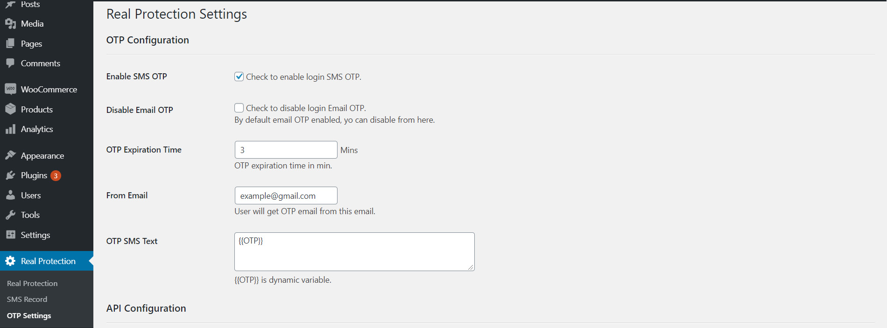

# Real Protection OTP & Woocommerce Alert

RP is an SMS & Email based OTP service provider plugin. Also available woocommerce transactional alert.
# Features!
  - OTP SMS
  - OTP Email
  - New user registration alert
  - Woocommerce transaction alert
  - Configurable custom API & Parameters
  - Dynamic variable.
### Prerequisites
  - Wordpress 5.*.*
  - WooCommerce 4.1.*
  - cURL php extension.
### Version
  - RP V1.0.0
  - Tested up to WooCommerce 4.1
### Download
```sh
Using HTTPS 
$ git clone https://github.com/prabalsslw/RP-OTP-Woocommerce.git
Using SSH 
$ git clone git@github.com:prabalsslw/RP-OTP-Woocommerce.git
```
### Installation
Follow the installation steps.
- Step 1: Upload the plugin to wordpress admin panel.[Img-1]
- Step 2: Go to `Real Protection` > `OTP Settings` page.
- Step 3: Enable OTP checkbox for OTP & SMS Alert. [Img-2]

### Image Reference
[Img-1] :

[Img-2] :
